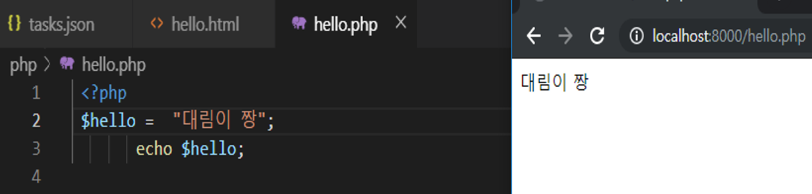

# 수업 2019.08.28
수업내용 정리

화면 캡쳐
 
Html 사용해서 ’hello world’ 화면에 보여주기 
 
h1,h2,h3,h4.....로 크기 조절해서 출력 
 

Php 설치를 해줍니다

Php에 ‘hello.php’라는 이름을 가진 파일 안에 내용을 보여줍니다.
마지막 종료태그 ?>를 삭제해도 php실행 가능합니다.

Php 서버를 실행하기 위해 ‘php –s localhost:8000’를 적어줍니다.

(localhost는 서버이름,포트는 8000번을 쓰겠다는 의미)

다시 시작했을 때 실행하게 하려면(보이게 하려면) 

<?php 
       ?>
안에 출력할 문자를 써서 보여줍니다.

프로그램 소스 안에 ‘ <?php ’와 ‘ ?> ’를 두개 사용할 수도 있습니다.

Print 를  사용해서도 문자열을 화면에 출력할 수 있습니다.

문자열 “대림이 짱”을 $hello변수에 저장하고 저장된 $hello 변수값을 화면에 출력합니다

한 줄 주석 => //
여러 줄 주석 => /* */

문자열 “~~”을 $~~변수에 저장하면 저장된 $~~ 변수값을 화면에 출력합니다.

8번째 줄은 $name = abc  -> $abc = 대림이

Typora 다운로드

Git 다운로드

Git hub 다운로드

Git hub를 사용해서 파일 올리기

