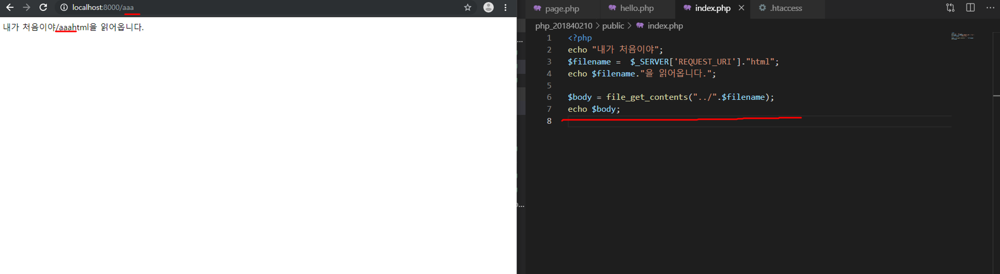

# 수업 2019.09.04
수업내용 정리

화면 캡쳐

교수님의 계정에 들어가 fork를 합니다.
Clone or download를 눌러 주소를 복사 후 붙여 넣기를 해줍니다

새롭게 daelim_2019_2 파일을 만들어 줍니다.
그 후 마우스 왼쪽을  눌러 Git Bash here로 열어줍니다

저걸 치면 내가 만든 파일에 파일이 생성이 됩니다. ( .git  /index..)

$ code index.md를  써주면 파일이 열립니다
 
스페이스를 두 번하면  줄 바꿈
학번 과 저장장소 적어 놓기
 
 
수정 후 add 를 써준다.

Report_201840210을 만들기 위해 이메일과 이름을 써준다.
Push ~~ 내 계정에 넣어 준다는 뜻

파일 올리기

https://github.com/jinyphp/jiny에서 지니를 찾아서 다운로드 해줍니다

Cmd에다가 composer써주기

지니라는 폴더 만든 후 Git Bash here 로 연다.
composer써주기.

Jiny new mywed 다운로드한후
Cd myweb해서 찾고 
Php –A localhost:8000 써준 다음 인터넷에 들어가 주소 써준다

Php 파일 열고 오픈 인 터미널 해서 
Php –s localhost:8000 친 다음 내용을 적고 
인터넷으로 열어준다.

. 쓰면 문자열 더해준다.(책 60쪽) 
상수는 중복 x

상수 중복는  안된다.

__LINE__ => 파일의 현재 줄 표시

위에는 php, 아래는 html

Php에서 html 에 있는 거 불러오기 (볼 수 있다.)

$는 변수  (책 110쪽)

저 사이트 쓰는 곳에 ?name = 대남이 치기
(원하는 이름을 쓰면 그대로 나온다.)

이름이 같아야 한다

두 개를 같이 보고 싶다면 ‘ & ’쓰기

저기 오른쪽 마우스 눌러서 Add Floder to Workpace..php_201840210열어서 페이지 html, php 옮겨놓은 거 열어준다.

Git status를 쓴다.

Git add .
Git status를 다시 써주고 

Git commit –m “page”를 써준다 

Php_201840210 폴더에다가 index.php를 만든다.
Jiny에 있는 myweb에 있는 .htaccess 를 옮겨놓는다

Echo $_SERVER[‘REQUEST_URI’];  를 써주면 주소에다 뭐라고 써도 그대로 나옵니다

주소창에 쓴 그대로 나온다

https://startbootstrap.com 테마 다운로드 후 php_201840210파일로 옮겨주기

Public에다가 css와 vender을 옮겨준다.

Hello.html에다가 index에 있는 걸 복사 붙여 넣기를 한다. 그 다음 {(main)}을 적어준다.

Hello.html에다가 index에 있는 걸 복사 붙여 넣기를 한다. 그 다음 {(main)}을 적어준다.

