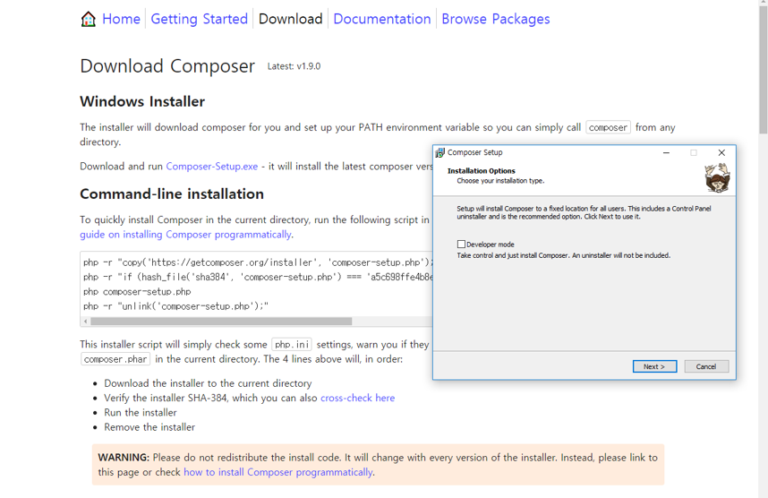

# 수업 2019.09.04
수업내용 정리

화면 캡쳐  
  
교수님의 계정에 들어가 fork를 합니다. 
Clone or download를 눌러 주소를 복사 후 붙여 넣기를 해줍니다 
 
새롭게 daelim_2019_2 파일을 만들어 줍니다. 
그 후 마우스 왼쪽을  눌러 Git Bash here로 열어줍니다 
 
 
저걸 치면 내가 만든 파일에 파일이 생성이 됩니다. ( .git  /index..) 
 
$ code index.md를  써주면 파일이 열립니다 
  
스페이스를 두 번하면  줄 바꿈 
학번 과 저장장소 적어 놓기 
  
  
수정 후 add 를 써준다. 
 
Report_201840210을 만들기 위해 이메일과 이름을 써준다. 
Push ~~ 내 계정에 넣어 준다는 뜻 
 
파일 올리기 
 
https://github.com/jinyphp/jiny에서 지니를 찾아서 다운로드 해줍니다 
 
Cmd에다가 composer써주기 
 
지니라는 폴더 만든 후 Git Bash here 로 연다. 
composer써주기. 
 
 
Jiny new mywed 다운로드한후 
Cd myweb해서 찾고  
Php –A localhost:8000 써준 다음 인터넷에 들어가 주소 써준다 
 
Php 파일 열고 오픈 인 터미널 해서  
Php –s localhost:8000 친 다음 내용을 적고  
인터넷으로 열어준다. 
 
. 쓰면 문자열 더해준다.(책 60쪽)  
상수는 중복 x 
 
상수 중복는  안된다. 
 
__LINE__ => 파일의 현재 줄 표시 
 
위에는 php, 아래는 html 
 
Php에서 html 에 있는 거 불러오기 (볼 수 있다.) 
 
$는 변수  (책 110쪽) 
 
저 사이트 쓰는 곳에 ?name = 대남이 치기 
(원하는 이름을 쓰면 그대로 나온다.) 
 
이름이 같아야 한다 
 
두 개를 같이 보고 싶다면 ‘ & ’쓰기 
 
저기 오른쪽 마우스 눌러서 Add Floder to Workpace..php_201840210열어서 페이지 html, php 옮겨놓은 거 열어준다. 

Git status를 쓴다. 
 
Git add . 
Git status를 다시 써주고  

Git commit –m “page”를 써준다  
 
 
Php_201840210 폴더에다가 index.php를 만든다. 
Jiny에 있는 myweb에 있는 .htaccess 를 옮겨놓는다 
 
Echo $_SERVER[‘REQUEST_URI’];  를 써주면 주소에다 뭐라고 써도 그대로 나옵니다 
 
주소창에 쓴 그대로 나온다 
 
https://startbootstrap.com 테마 다운로드 후 php_201840210파일로 옮겨주기 
 
Public에다가 css와 vender을 옮겨준다. 
 
Hello.html에다가 index에 있는 걸 복사 붙여 넣기를 한다. 그 다음 {(main)}을 적어준다. 
 
Hello.html에다가 index에 있는 걸 복사 붙여 넣기를 한다. 그 다음 {(main)}을 적어준다. 
 

