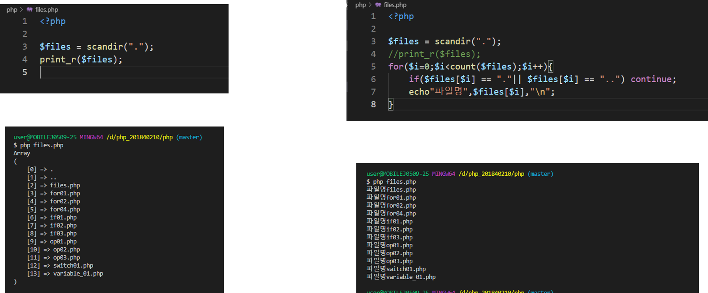

# 수업 2019.09.11
수업내용 정리

화면 캡쳐
 
Live Sever 다운로드 
 
https://javascript.jiny.dev에 들어가면  
자바스크립트에 대해 정리 되어있습니다 
 
코드 작성 후 출력 
 
Body 안에 script 가 들어가도 출력이 된다.  (위치만 바뀐다.) 
 
Script.js라는 파일을 하나 더 만든 다음 자바스크립트 소스를 html에 외부소스 설정으로 변경. 외부 소스로 변경하기 위해서는  script 태그로~   
  
Console.log를 쓴 다음 크롬에 들어가서 f12을 누르면 개발자 도구가 뜬다. 거기에 있는 Console창에 들어가서 확인~ 
  
직접 입력을 해도  
콘솔모드에서 보인다. 

콘솔 창에다가 document.write를 사용해서 쓰면 화면에 출력이 된다 
  
Alert는 브라우저에 메시지 창 뜨게 하기 
 
https://nodejs.org 에 들어가서 다운 
 
콘솔을 실행해서 node 명령어 입력 
 
Setting - terminal에 들어가서 내용을 쳐 준 다음 terminal로 열어서 확인 
 
변수를 만들 때는 소문자로 쓰기 
 
변수는 대소문자 구분합니다 
 
 
name = hello 니까  Name [0] 은  1번째에 있는 글자 h를 출력 
 
\n은 그 다음줄로  
 
Var는 명시적 선언 키워드 입니다(옛날 방식 ) 
 
값의 복사 
 
Java script(왼쪽) 
typeof는 변수의 데이터 타입을 반환하는 연산자입니다. 17은 숫자니까 number로 반환. 
php(오른쪽) 
var_dump는 변수의 정보를 출력하는 함수입니다.      [ int(17) : 정수이고, 값은 17입니다. ] 
 
Java script 
이때 주의해야 하는 점은 따옴표가 아닌 백틱으로 문자열을 감싸서 처리를 합니다. 
 
1.Git add를 한다. 
2.Git commit을 한다. 
3.Vi 에디터로 들어가서 Esc+i를 눌러 삽입모드로 해서 파일 이름 저장하고 수정한다음 ESC+.WQ를 눌러 저장을 한다. 
 
책 122쪽 
 
참조 대입 연산자  
$a = &$d;  

 
책 121쪽 ~ 124쪽  

참조 대입 연산자  
$a = &$d;  

 
책 129쪽 
/ => 나누기 
% => 나머지 
(정수로 나타낸다) 
 
 1씩 늘어난다 
 1씩 늘어나다가 
 1씩 줄어든다. 

 
책  149  165 
후순위일 때는 변수를 참조 후에 값이 변경됩니다. 
 
제어문 : 조건값을 이용하여 참과 거짓에 대한 동작을 구분합니다. 
If 문  
조건값은 참일때 동작을 합니다./ 조건이 참이 아닌 경우  
else 이후의 문장을 출력합니다. 
 
<A && B=> A와 B 둘 다 모두 참인 경우 참>  
Sex가 남자이고 age가 19보다 크거나 같을 때 
“남자 성인입니다” 출력.  
 
< switch 문 > 
case는 표현식과 값이 일치하는 경우에 동작을 수행합니다. 

N이 1이니까 case가 1일 때의 값을 출력 

 
< 3항 연산자 > 
If조건문을 간략하게 약식형태의 연산자처럼 표현 할 수 있는 방법 

조건식 ? True : false 

조건식이 맞으면 true값 출력, 틀리면 false 값 출력 

Ko 는 true니깐 한국어 출력 
 
< for : 반복문 >
 
For(초기값;조건;증가 연산자 ) { 
반복되는 수행문; 
} 

증가 연산자는 { } 안에 만 쓰면 값은 똑같다. 

 
i는 = 0 부터  
5보다 작은 수까지  
하나씩 증가한다. 

만약 i가 2가 나오면  
아니야~~라는 말을 출력 하고 멈춘다. 

 
 i는 1부터 10까지 1씩 증가하는데 
만약 i가 2로 나누어져서 나머지가 0이 된다면  
그 숫자와 함께 짝수라고 출력 

(Continue : 아래 코드 실행하지 않고  건너뛰기) 

 i는 1부터 10까지 1씩 증가하는데 
만약 i가 2로 나누어져서 나머지가 0이 된다면 
Continue  만나 아래 코드 건너뛰고   
Else를 만나 그 반대 되는 홀수 출력 
 
Scandir => 해당 폴더에 있는 파일&폴더를 보여준다 
 
책 219쪽
 
Foreach : 간단하게 사용할 수 있는 반복 문법 

Foreach($array as $ value){ 
         반복 실행 코드; 
} 
 그 다음 {(main)}을 적어준다. 
 
< 무한 루프 > 
조건이 항상 참인 상태 
 
Conf 가 참 => 바보야 
 i가 0부터 5보다 작기전까지 1씩 커지다가 5보다 커지면 거짓이 되어서 멈춘다 

 
File_get_contents(“ 파일 ”);
 
=>파일을 불러온다  

 
 
종료하는 법~~!!
 

