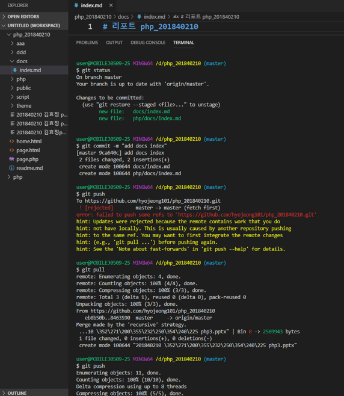
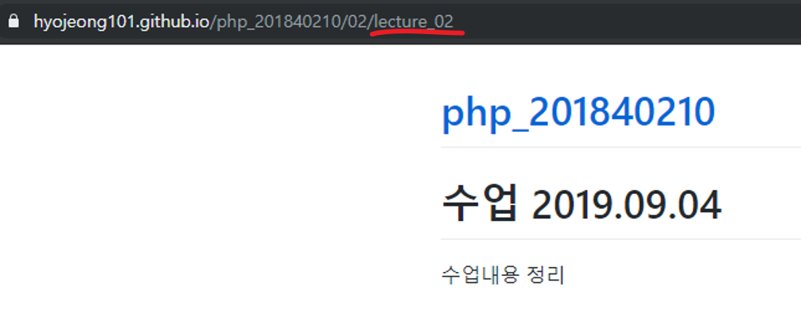

# 수업 2019.09.18
수업내용 정리

화면 캡쳐

Docs 폴더에 index.md 만들어서 내용을 써서 git hub에 저장  

 https://hyojeong101.github.io/php_201840210/. 에 들어가서 확인

이동을 누르면 ./lecture_01 페이지로 이동

첫번째 폴더 3개 복사해서 이동할 경로 각각 바꿔주기

 
Lecture_02폴더를 누르면 사이트가 안뜬다.
 
Lecture_02를 사이트 경로에 직접 써주면 열린다
 
01폴더에 이미지 넣기

Html로 만들기

Cd로 php폴더 찾은 다음 보고 싶은 폴더 검색하면 거기에 있는 글 확인

Php –S localhost:8000 치면 크롬으로 http://localhost:8000/원하는 폴더     를 치면 나옵니다.

한번 호출/한번 호출

호출을 function 위에 호출해도 결과가 나온다.

If 위에 hello가 호출이 되면 화면에 나타나지 않는다

1번에 반가워요가 먼저 보이고 2번에 대림이가 3번에 선언이 되고 반가워요 뒤에 써주면 이어서 출력 된다

가변함수는 변수명에 함수명을 대입하고 $변수명(); 형태로 함수 호출

Korean 선언

English 선언

Lang 은 lang

만약 lang 이 ko면 
Korean 

아니면 English

가변함수일때는 ;로 마무리 하기

함수 뒤에 ()를 붙이지 않으면, 함수 실행 안된다.

주석 단 내용이랑 밑에 내용이랑 같은 내용 출력

재귀함수는 함수가 자기자신을 호출하는 것을 말합니다.

만약 i가 2가 나오면 
아니야~~라는 말을 출력 하고 멈춘다.

무한루프

만역 5가 0보다 크면 5가 나오고 1씩 줄어든다

