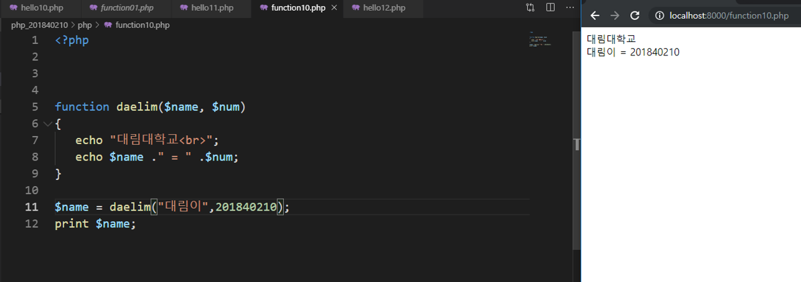
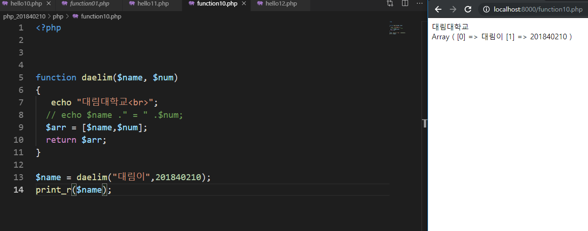
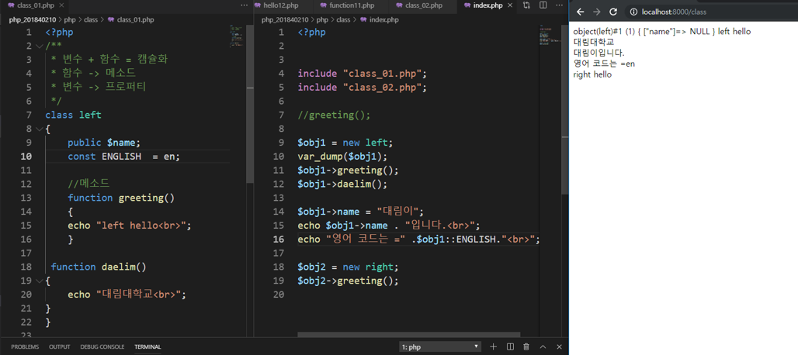
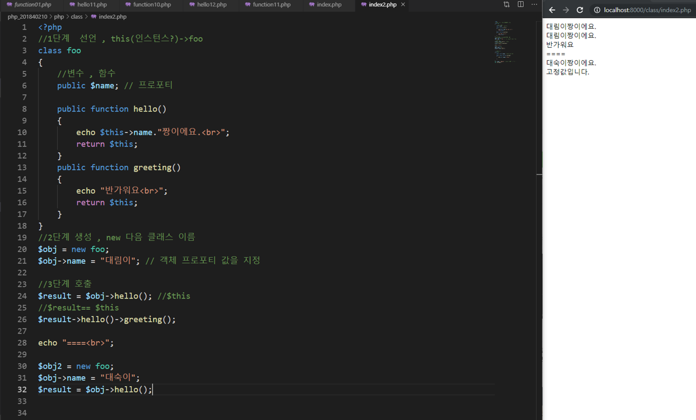
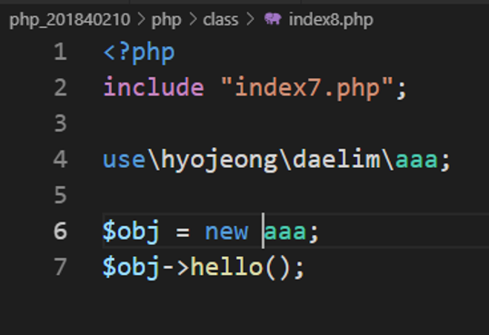

# 수업 2019.09.25
수업내용 정리

화면 캡쳐
 
  /n 줄 바꾸기  

 
Php 폴더에서 열기 

Cd .. 으로 전 폴더로 간 다음, 학번 폴더에서 열기 
 
165쪽 오류연산자 

php 는 오류제어연산자 @를 지원합니다. 
오류 제어 연산자를 코드 앞에 붙여서 사용하면 발생된 오류 메시지를 무시하게 됩니다 

 
-하위 디렉터리- 
./ 파일명 : 현재의 디렉터리의 파일명 
./폴더1/파일명 : 현재의 디렉터리의 하부 폴더 1의 파일 
-상위 디렉터리- 
../파일명: 현재 디렉터리 상위 폴더의 파일명 

 
Require 실행중단,  파일이 없으면 중단된다. 

Include로 하면 오류는 뜨고 실행, 
Require로 하면 오류도 뜨고 실행도 안된다. 

  
275쪽~ 

Inclue – php 에서 전처리 명령 inclue를 통해 소스 파일을 삽입하면 전처리기 명령을 선언한 소스 그 자리 안에 지정한 파일의 소스가 삽입(277쪽) 

Require – 좀 더 유연한 소스 결합과 엄격한 소스 결합을 구분하기 위함(286쪽) 

  
Require 된 파일에 없어서 오류가 난다. 

  
279쪽  

Hello 폴더에 hello12를 넣었을 때 
./폴더이름/보고싶은 폴더이름 
-하위 디렉터리- 
./ 파일명 : 현재의 디렉터리의 파일명 
./폴더1/파일명 : 현재의 디렉터리의 하부 폴더 1의 파일 
-상위 디렉터리- 
../파일명: 현재 디렉터리 상위 폴더의 파일명 
 
Php201840210 에  hell10파일을 넣었을 때 
 
함수명으로는 가능한 숫자로 시작하는 거는 안된다. 
(함수 이름 가능한게 무엇이고 불가능하게 무엇인지 찾아보기) 

39쪽 
Tab 으로 들여쓰기 
 
 
Return 함수 값 하나만 출력 

Return 키워드 다음에 반환할 값 또는 변수 적기 
 
 
파란책 23쪽 배열만드는법  / 24쪽 list  함수 
 
Inculde 2번 쓰면 오류 
함수명(include)은 두 번 쓰면 오류 
 
Include 명령어는 중복 사용할 경우 여러  문제가 발생하기 때문에 한번만 Include 해야 하는 스크립트가 있으면 Include_once 를 사용한다. 

 
function_exists : 함수가 존재 하는지 존재 하지 않는지 체크 하는 함수 
 
Index 부터 찾아서 index 안치고 class만 쳐도 나온다 
 
 
new다음에는 클래스 명 
 
 
 
 
 
 
 
345 메소드 체인 
 
 
 
 
result->hello(); 
$result->greeting 
 
 
 
 
__construct()메서드는 객채 생성 시 초기값 설정을 해주는 특수 메서드 입니다. 

 

 
 
접근제한자  3개 

플라이빗 -개인적 클래스 내부안에서만 사용////프로텍 
 
Extend 사용해서 클래스 상속하기 

 
 
덮어쓰기  
오버라이딩 
  
  
Hello만들어야 하는데 안 만들어 줘서 
  
추상클래스는 상속받는다 

  
  

//trait 혼자 객체를 만들수 없다. 
뉴 인터페이스  
뉴 추상클래스 혼자 x 
다른클래스에 삽입해야함 

trait 도 상속된다/. 

  
  
별칭 너무 길면 use 사용 

  
  
  
  
둘 다 똑같다. 저런게 있다 알기/글로벌은 무조건 대문자 
  

