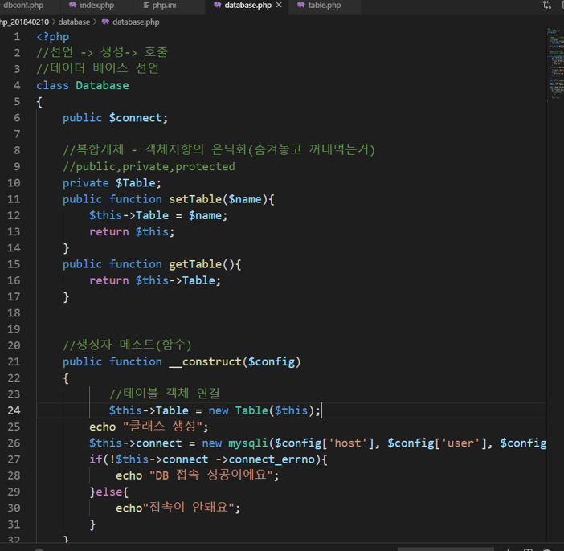
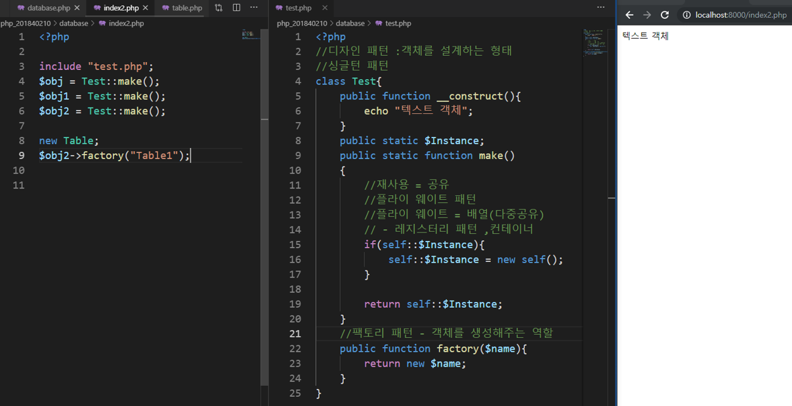

# 수업 2019.10.16
수업내용 정리

화면 캡쳐

Php201840210 에 database안에 
index.php 만들고 글 작성 후 열기

서버정보와 mysql 접속 코드

user를 php user 로 하고 cmd에다가 저거 쳐주고 다시 시작하면 접속 성공뜬다 

닫아 주기(37쪽)

Members1테이블 생성

생성자 동작x 객체 못만듬

<Git에 저장하고 php 끄는법>

$ git add .
$ git commit -m "1023“
$ git pull
$ git push

